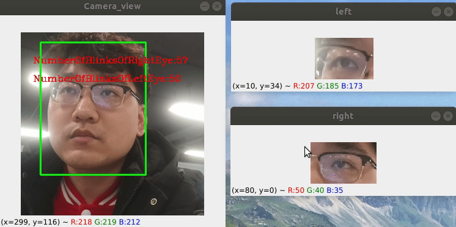

眨眼检测演示
============



本演示展示了眨眼检测网络。您可以在演示中使用以下一组预先训练的模型：

-   `face_mesh` 是预测人脸关键点的的主要网络
-   `open-closed-eye-0001` 是判断眼睛开阖的主要检测网络

安装依赖项
----------

依赖项

-   Python ( 3.6+ )
-   OpenCV ( \>=3.4.0 )
-   DepthAI ( \>=2.13.0.0 )

要安装所有必需的 Python 模块，您可以使用：

``` {.shell}
pip3 install -r requirements.txt
```

运行演示
--------

使用 -h 选项运行应用程序会产生以下用法消息：

``` {.bash}
Usage: blink.py [OPTIONS]

    在视频流中实时检测和计数眨眼次数

Options:
  -vid, --video / -cam, --camera  使用 DepthAI 4K RGB 摄像头或视频文件进行推理  [default:
                                  cam]
  -p, --video_path PATH           指定用于推理的视频文件的路径
  -o, --output PATH               指定用于保存的视频文件的路径
  -fps, --fps INTEGER             保存视频的帧率  [default: 30]
  -s, --frame_size <INTEGER INTEGER>...
                                  保存视频的宽度，高度  [default: 1080, 1080]
  -h, --help                      Show this message and exit.
```

运行该应用程序的有效命令行示例：

``` shell
python3 blick.py -cam
```

或

``` shell
python3 blink.py -vid -p <path_to_video>
```

保存推理视频：

``` shell
python3 blink.py -o <path_to_video> -fps 30 -s 1080,1080
```

要运行该演示，可以使用公共或预训练的模型。要下载预训练的模型，请使用
`OpenVINO`
[模型下载器](https://docs.openvinotoolkit.org/latest/omz_tools_downloader_README.html)。

> 该示例需要的模型已在 [models](./models) 文件夹中。
