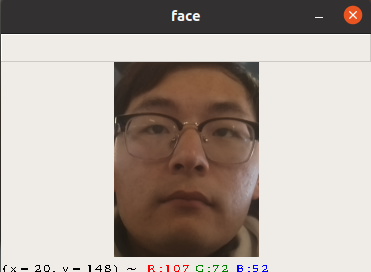
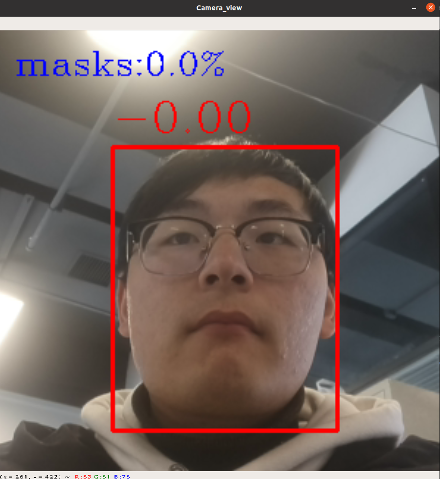
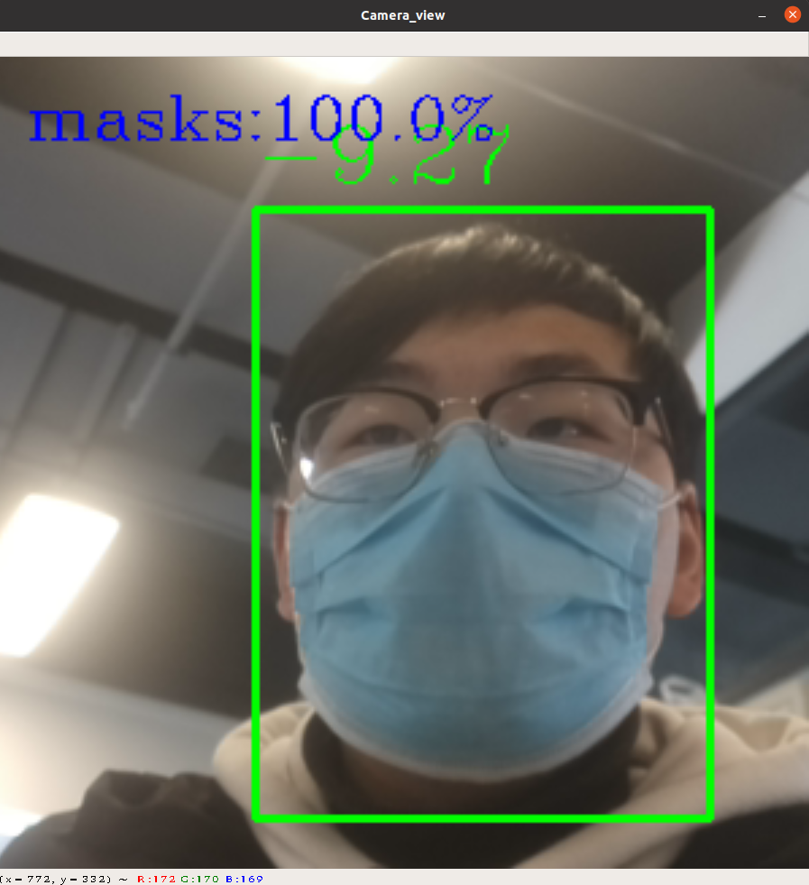

口罩检测
==================================

此示例展示了用于构建模型管道的基本架构，该模型管道支持在不同设备上放置模型以及使用python中的DepthAI库同时并行或顺序串行。

此示例使用2个模型构建了一个管道，该管道能够检测图像上的人脸及面部是否佩戴口罩。

代码原理说明：
##################################

1. 运行人脸检测模型
**********************************

   运行face-detection-retail-0004.blob模型检测图像中的人脸，并截取面部图像。

   |Screenshot from 2021-01-14 13-44-58|

2. 运行口罩检测模型
**********************************

   运行sbd_mask4.blob模型检测传入的面部图像中是否佩戴口罩。

   未佩戴口罩

   |Screenshot from 2021-01-18 09-44-13|

   已佩戴口罩

   |Screenshot from 2021-01-18 09-44-37|

程序使用说明
##################################

安装依赖
************************************

.. code-block:: python

   python -m pip install -r requirements.txt

使用设备运行程序
************************************

.. code-block:: python

   python main.py -cam

使用视频运行程序
***********************************

.. code-block:: python
   
   python main.py -vid <path>

按'q'退出程序。