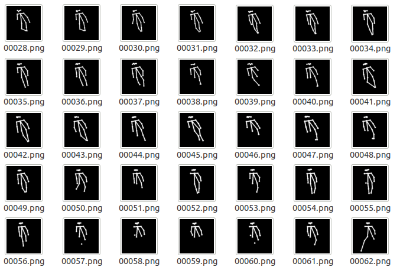

# DepthAI 上的跌倒检测

[](https://www.bilibili.com/video/BV1eA411w7Az?share_source=copy_web)


在 [DepthAI](https://docs.luxonis.com/en/latest/) 硬件（OAK-1、OAK-D...）上运行 Google MoveNet Single Pose 模型。

## MoveNet

在 RGB 图像上运行并预测 [人体关节位置](https://github.com/tensorflow/tfjs-models/tree/master/pose-detection#coco-keypoints-used-in-movenet-and-posenet)的卷积神经网络模型的一个人。 两种变体：Lightning 和 Thunder，后者更慢但更准确。

当输入是一系列帧时，MoveNet 使用基于前一帧检测的智能裁剪。 这允许模型将注意力和资源集中在主要主题上，从而在不牺牲速度的情况下获得更好的预测质量。


依据 *MoveNet* 结果生成骨骼图，把骨骼图片传入全连接层，全连接层对骨骼进行判断，输出骨骼状态（*fall* or *normal*），并使用宽高比进行辅助判断




## 安装

使用以下命令安装 python 包，例如 DepthAI、Opencv：
```
python3 -m pip install -r requirements.txt
```

## Run

**Usage:**

```
> python3 demo.py -h                                               
usage: demo.py [-h] [-m MODEL] [-i INPUT] [-c] [-s SCORE_THRESHOLD]
               [--internal_fps INTERNAL_FPS]
               [--internal_frame_height INTERNAL_FRAME_HEIGHT] [-o OUTPUT]

optional arguments:
  -h, --help            show this help message and exit
  -m MODEL, --model MODEL
                        Model to use : 'thunder' or 'lightning' or path of a
                        blob file (default=thunder)
  -i INPUT, --input INPUT
                        'rgb' or 'rgb_laconic' or path to video/image file to
                        use as input (default=rgb)
  -c, --crop            Center crop frames to a square shape
  -s SCORE_THRESHOLD, --score_threshold SCORE_THRESHOLD
                        Confidence score to determine whether a keypoint
                        prediction is reliable (default=0.200000)
  --internal_fps INTERNAL_FPS
                        Fps of internal color camera. Too high value lower NN
                        fps (default: depends on the model
  --internal_frame_height INTERNAL_FRAME_HEIGHT
                        Internal color camera frame height in pixels
                        (default=640)
  -o OUTPUT, --output OUTPUT
                        Path to output video file
```
**Examples :**

- 在内置彩色摄像头上运行 Thunder 模型：

    ```python3 demo.py```

- 在内置彩色摄像头上运行 Lightning 模型：

    ```python3 demo.py -m lightning```

- 要在文件（视频或图像）上运行 Thunder 模型：

    ```python3 demo.py -i filename```

- 要将内部摄像头的 FPS 更改为 15 帧/秒： 

    ```python3 BlazeposeOpenvino.py --internal_fps 15```

    > 注意：默认情况下，Lightning 的内置相机 FPS 设置为 26，Thunder 设置为 12。 这些值基于我自己的观察。 **请不要犹豫，使用此参数来寻找最佳值。** 如果您发现 FPS 远低于默认值，则应使用此选项降低 FPS，直到设置的 FPS 刚好高于默认值 观察到的 FPS。

- 使用内置摄像头时，您可能不需要使用全分辨率。 通过使用此选项，您可以使用较低的分辨率（并提高一些 FPS）：

    ```python3 BlazeposeOpenvino.py --internal_frame_size 450```

    > 注意：目前，depthai 仅支持此参数的一些可能值。 您指定的值将替换为最接近的可能值（此处为 432 而不是 450）。


| 按键     | 功能              |
| -------- | ----------------- |
| *空格键* | 暂停              |
| c        | 显示/隐藏裁剪区域 |
| f        | 显示/隐藏 FPS     |

## 模型 
它们是由 PINTO 从原始模型 [Thunder V3](https://tfhub.dev/google/movenet/singlepose/thunder/3) 和 [Lightning V3](https://tfhub.dev/google/movenet/singlepose/lightning/3) 转换而来。目前，它们是对可用模型的轻微改变（由于深度ImageManip节点不支持交织图像）：https://github.com/PINTO0309/PINTO_model_zoo/tree/main/115_MoveNet。

## Credits
* [Google Next-Generation Pose Detection with MoveNet and TensorFlow.js](https://blog.tensorflow.org/2021/05/next-generation-pose-detection-with-movenet-and-tensorflowjs.html)
* Katsuya Hyodo a.k.a [Pinto](https://github.com/PINTO0309), the Wizard of Model Conversion !
