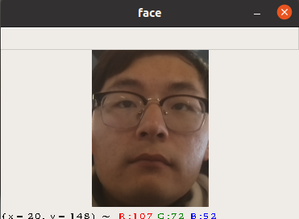
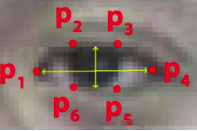
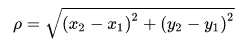
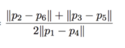
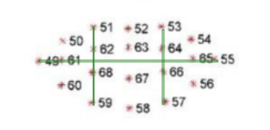
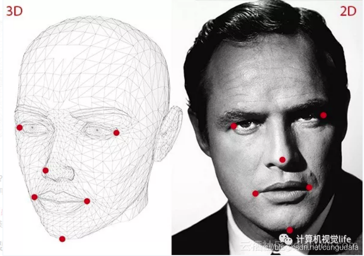

示例-疲劳检测
==============================

此示例使用两个模型构建了一个管道，该管道能够检测图像上的人脸及面部特征点，通过面部特征点实现对眨眼、打哈欠和头部姿态的检测。

代码原理说明：
###############################

1. 运行人脸检测模型
********************************

   程序首先运行face-detection-retail-0004.blob模型检测图像中的人脸，并截图面部图像。

|IMG_256|

2. 运行面部特征点检测模型
*********************************

   然后运行face_landmark_160x160.blob模型从传入的面部图像中检测出68个特征点位置。利用这些特征点我们可以实现眨眼、打哈欠、点头检测。

   眨眼:

   一只眼睛有六个特征点

   |image1|

   我们利用欧氏距离公式计算上下眼皮之间的距离和眼睛的宽度。

   |image2|

   从而我们可以计算眼睛的长宽比：

   |image3|

   打哈欠：

   嘴部的计算方法和眼睛的计算一样。

   |Screenshot from 2021-01-21 09-18-02|

   利用嘴部的六个特征点计算嘴巴的长宽比。

   这样我们通过长宽比的变化判断眨眼和打哈欠。

   点头：

   头部姿态的计算较为复杂。

   第一步：2D人脸关键点检测；

   第二步：3D人脸模型匹配；

   第三步：求解3D点和对应2D点的转换关系；

   第四步：根据旋转矩阵求解欧拉角。

   |Screenshot from 2021-01-21 09-27-27|

程序使用说明
##################################

安装依赖
************************************

.. code-block:: python

   python -m pip install -r requirements.txt

使用设备运行程序
************************************

.. code-block:: python

   python main.py -cam

使用视频运行程序
***********************************

.. code-block:: python
   
   python main.py -vid <path>

按'q'退出程序。

