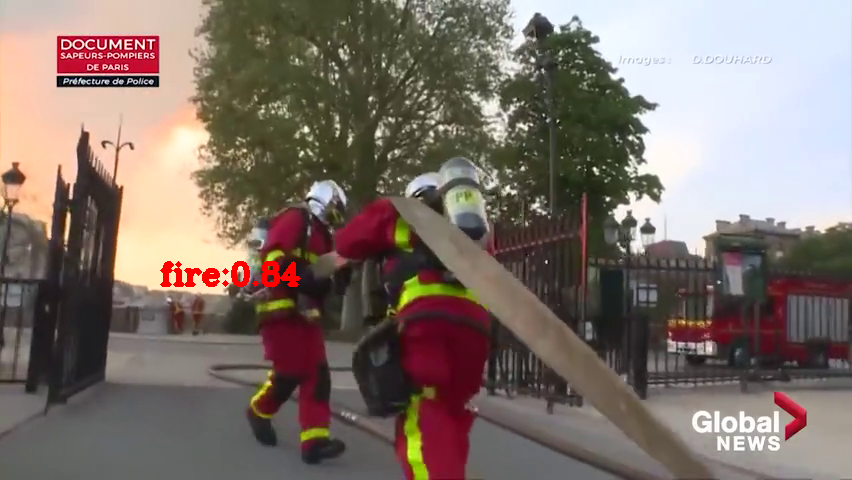

烟火检测演示
============

|  |  |
| :-----: | :-----: | 

本演示展示了基于深度学习的烟火检测器。您可以在演示中使用以下一组预先训练的模型：

-   `fire_detection` 检测火焰和烟雾

其他演示目标包括：

-   视频 / 摄像头作为输入（通过 OpenCV ）
-   使用火焰和烟雾检测功能来监控视频中的火灾

安装和依赖项
------------

依赖项

-   Python ( 3.6+ )
-   OpenCV (\>=3.4.0)
-   Depthai (\>=2.13.0.0)

要安装所有必需的 Python 模块，您可以使用：

``` {.shell}
pip3 install -r requirements.txt
```

运行演示
--------

使用 -h 选项运行应用程序会产生以下用法消息：

``` {.bash}
Usage: fire.py [OPTIONS]

  基于深度学习的烟火检测器

Options:
  -vid, --video / -cam, --camera  使用 DepthAI 4K RGB 摄像头或视频文件进行推理  [default:
                                  cam]
  -p, --video_path PATH           指定用于推理的视频文件的路径
  -o, --output PATH               指定用于保存的视频文件的路径
  -fps, --fps INTEGER             保存视频的帧率  [default: 30]
  -s, --frame_size <INTEGER INTEGER>...
                                  保存视频的宽度，高度  [default: 1080, 1080]
  -h, --help                      Show this message and exit.

```

运行该应用程序的有效命令行示例：

``` {.shell}
python3 fire.py -cam
```

或

``` {.shell}
python3 fire.py -vid -p <path_to_video>
```

该示例需要的模型已在
```models`` <https://github.com/Arducam-team/depthai-examples/tree/master/security_barrier_camera/models>`__
文件夹中。


