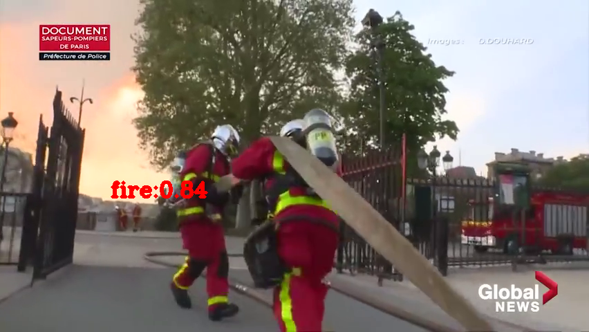
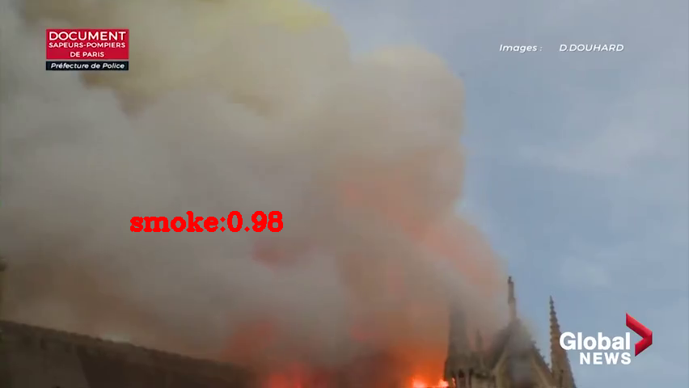

烟火检测演示
================



   fire\_demo1

本演示展示了基于深度学习的烟火检测器。您可以在演示中使用以下一组预先训练的模型：

-  ``fire_detection`` 检测火焰和烟雾

其他演示目标包括：

-  视频 / 摄像头作为输入（通过 OpenCV ）
-  使用火焰和烟雾检测功能来监控视频中的火灾

安装和依赖项
------------

依赖项

-  Python ( 3.6+ )
-  OpenCV (>=3.4.0)

要安装所有必需的 Python 模块，您可以使用：

.. code:: shell

    pip3 install -r requirements.txt

运行演示
--------

使用 -h 选项运行应用程序会产生以下用法消息：

.. code:: bash

    usage: main.py [-h] [-nd] [-cam] [-vid VIDEO] [-db] [-n NAME]
    
    optional arguments:
      -h, --help            show this help message and exit
      -nd, --no-debug       阻止调试输出
      -cam, --camera        使用 DepthAI 4K RGB 摄像头进行推理 (与 -vid 冲突)
      -vid VIDEO, --video VIDEO
                            用于推理的视频文件的路径 (与 -cam 冲突)
      -db, --databases      保存数据（仅在运行识别网络时使用）
      -n NAME, --name NAME  数据名称（和 -db 一起使用）
    
    使用空的选项列表运行应用程序会产生一条错误消息

运行该应用程序的有效命令行示例：

.. code:: shell

    python3 main.py -cam

或

.. code:: shell

    python3 main.py -vid <path_to_video>
    
    该示例需要的模型已在
    ```models`` <https://github.com/Arducam-team/depthai-examples/tree/master/security_barrier_camera/models>`__
    文件夹中。



   fire\_demo2
