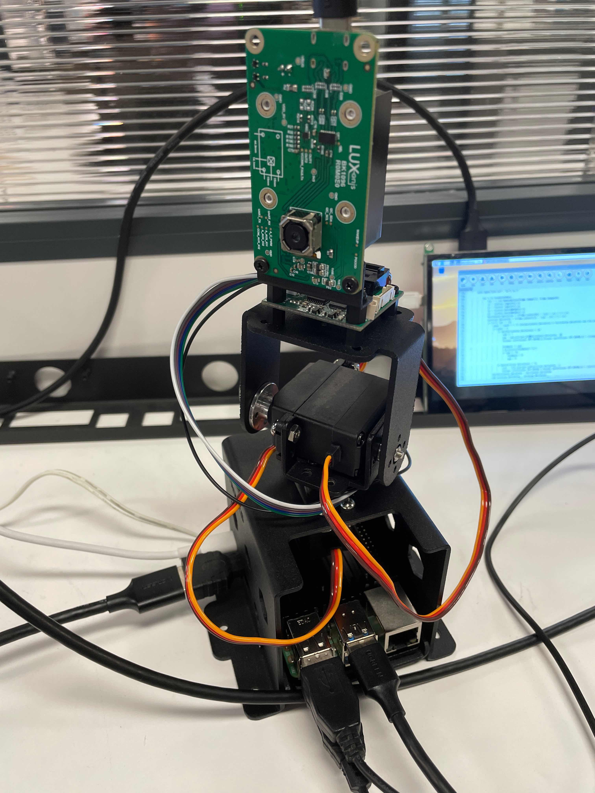
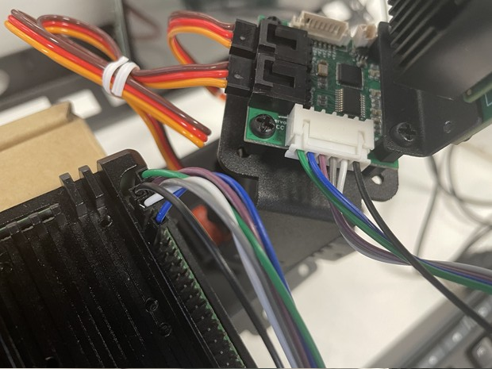

# Gen2 目标跟踪+跌倒检测

该示例演示了Gen2 Pipeline Builder运行的mobilenet-ssd神经网络模型，检测人物目标并控制云台将目标始终置于图像中央。

## 需要用到的硬件设备

- depthai
- 树莓派
- 云台

<div align="center">
    
</div>

### [云台购买详情请参考](https://www.uctronics.com/uctronics-pre-assembled-2-dof-pan-tilt-digital-servo-kit-full-metal-bracket-for-building-robotic-arms-ptz-cameras-and-more.html)

## 设备连接示意图

<div align="center">
    
</div>

## 演示

<div align="center">
    
</div>

## 安装依赖

依赖项

- depthai(>=2.2.0.0)
- opencv-python(>=3.4.0)
- python(3.6+)

要安装所有必需的 Python 模块，您可以使用：

```
python3 -m pip install -r requirements.txt -i https://pypi.tuna.tsinghua.edu.cn/simpl
```

## 运行演示

```
python3 tracker.py 
```