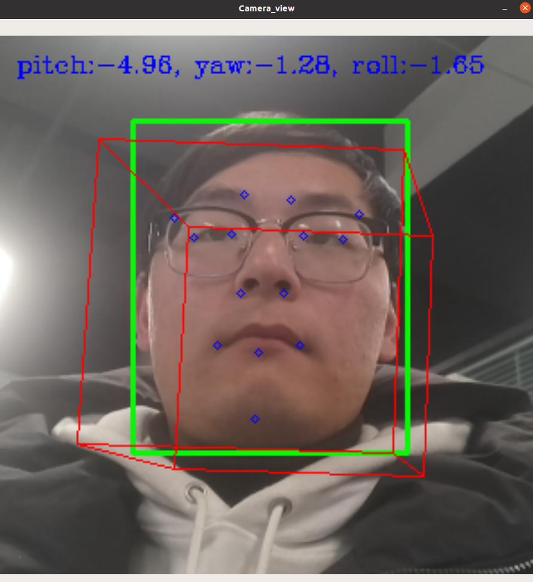

头部姿态检测
=============================

此示例使用两个模型构建了一个管道，该管道能够检测图像上的人脸及面部特征点，通过面部特征点实现对头部姿态的检测。

代码原理说明：
###############################

1. 运行人脸检测模型
*******************************

   程序首先运行face-detection-retail-0004.blob模型检测图像中的人脸，并截图面部图像。

|IMG_256|

2. 运行面部特征点检测模型
*******************************

然后运行face_landmark_160x160.blob模型从传入的面部图像中检测出68个特征点位置。利用这些特征点我们可以实现头部姿态检测。

   第一步：2D人脸关键点检测；

   第二步：3D人脸模型匹配；

   第三步：求解3D点和对应2D点的转换关系

   第四步：根据旋转矩阵求解欧拉角。

   |image1|

-  

.. |IMG_256| image:: media/image1.png
   :width: 3.86458in
   :height: 2.83333in

程序使用说明
##################################

安装依赖
************************************

.. code-block:: python

   python -m pip install -r requirements.txt

使用设备运行程序
************************************

.. code-block:: python

   python main.py -cam

使用视频运行程序
***********************************

.. code-block:: python
   
   python main.py -vid <path>

按'q'退出程序。