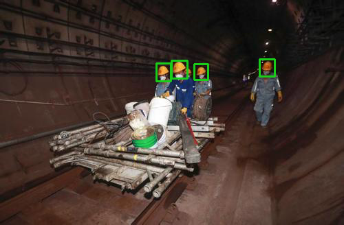

安全帽检测演示
====================

[](https://www.bilibili.com/video/BV1LM4y1L7PZ?share_source=copy_web)

本演示展示了目标检测网络。您可以在演示中使用以下一组预先训练的模型：

-   [`helmet_detection`](models/helmet_detection_yolox1_openvino_2021.4_6shave.blob) 是目标检测网络

安装依赖项
----------

依赖项

-   Python ( 3.6+ )
-   OpenCV (\>=3.4.0)
-   DepthAI (\>=2.8.0.0)

要安装所有必需的 Python 模块，您可以使用：

``` shell
pip3 install -r requirements.txt
```

运行演示
--------

使用 -h 选项运行应用程序会产生以下用法消息：

``` shell
usage: main.py [-h] [-nd] [-cam] [-vid VIDEO] [-o OUTPUT_DIR] [-is INPUT_SHAPE [INPUT_SHAPE ...]] [-os OUTPUT_SHAPE [OUTPUT_SHAPE ...]] [-f FPS]

optional arguments:
  -h, --help            show this help message and exit
  -nd, --no-debug       Prevent debug output
  -cam, --camera        Use DepthAI 4K RGB camera for inference (conflicts with -vid)
  -vid VIDEO, --video VIDEO
                        The path of the video file
  -o OUTPUT_DIR, --output_dir OUTPUT_DIR
                        The directory of the output video.
  -is INPUT_SHAPE [INPUT_SHAPE ...], --input_shape INPUT_SHAPE [INPUT_SHAPE ...]
                        The shape (h, w) of the input stream used only for the camera stream. 
                        Default value: 720, 1280
  -os OUTPUT_SHAPE [OUTPUT_SHAPE ...], --output_shape OUTPUT_SHAPE [OUTPUT_SHAPE ...]
                        The shape (h,w) of the video to be saved. 
                        The default is the shape of the input stream
  -f FPS, --fps FPS     Set the FPS (only for the output video of the camera stream). 
                        Default value: 30
```

运行该应用程序的有效命令行示例：

``` shell
python3 main.py
```

或

``` shell
python3 main.py -vid <path_to_video>
```

该示例需要的模型已在 [models](./models) 文件夹中。
