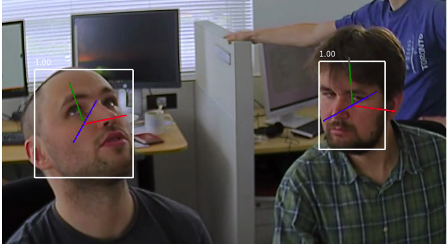

人脸识别：
===================================

此示例展示了第二代模型管道构建器的基本架构，将多个神经网络模型并行或串联组合在一起，ROI从一个网络传递到一个或多个后续的网络中。

此示例使用3个模型构建了一个管道，该管道能够检测视频上的面部，及其面部特征点，并使用提供的面部数据库识别人员。

代码原理说明：
###################################

1. 从人脸库读取图片
***********************************

   |yangjunwen_1|

2. 运行模型
***********************************

   运行face-detection-retail-0004模型检测图像中的人脸，并截取面部图像。

   |Screenshot from 2020-12-24 13-59-26|

   运行landmarks-regression-retail-0009模型检测面部特征点
   
   |Screenshot from 2020-12-24 14-00-34|

   图像几何变换，使用cv2.warpffine函数将面部转正

   |Screenshot from 2020-12-25 08-51-38|
   
   如上图所示将面部倾斜的图像转正

   运行face-reidentification-retail-0095模型获取特征向量
   
   |Screenshot from 2020-12-24 14-10-20|

   将获取到的图片特征向量添加到列表中，以备后续与从板载相机获取的图像进行比较

   从板载相机获取图像并执行以上过程

3. 余弦计算
************************************

   余弦相似度计算公式

   |Screenshot from 2020-12-24 14-24-23|

   将人脸库中图片的特征向量和从相机获取的图像的特征向量进行余弦距离计算。余弦距离越近相似度越高，设置阈值进行判断

4. 最终效果
************************************

   |Screenshot from 2020-12-24 14-19-19|

程序使用说明
####################################

安装依赖
************************************

.. code-block:: python

   python -m pip install -r requirements.txt

拍照并保存到人脸库
************************************

.. code-block:: python

   python main.py -pho -n (your name)

按's'保存图片，按'q'退出程序。

使用设备运行程序
************************************

.. code-block:: python

   python main.py -cam

按'q'退出程序。

使用视频运行程序
***********************************

.. code-block:: python
   
   python main.py -vid <path>

按'q'退出程序。

应用程序流程图
#####################################

   |face|

