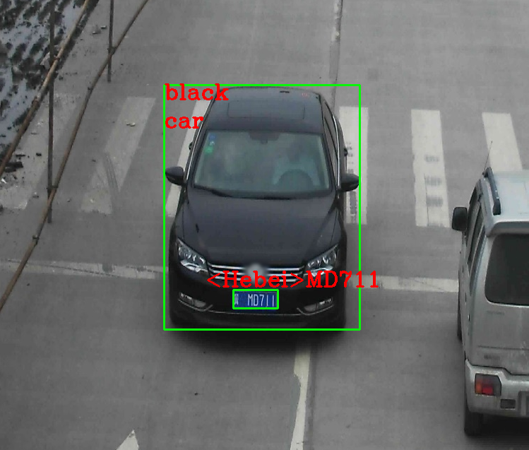

车辆车牌识别演示
================



本演示展示了车辆和车牌检测网络，以及在检测结果之上应用的车辆属性识别和车牌识别网络。您可以在演示中使用以下一组预先训练的模型：

-   `vehicle-license-plate-detection-barrier-0106`
    是查找车辆和车牌的主要检测网络
-   `vehicle-attributes-recognition-barrier-0039`
    会根据第一个网络的结果执行，并报告常规车辆属性，例如车辆类型（`car`
    / `van` / `bus` /`track`）和颜色
-   `license-plate-recognition-barrier-0007`
    在第一个网络的结果之上执行，并报告每个识别的牌照的字符串

其他演示目标包括：

-   视频 / 摄像头作为输入（通过 OpenCV ）
-   复杂异步网络管道的示例：在车辆检测结果之上执行车辆属性和车牌识别网络
-   可视化每个检测对象的车辆属性和车牌信息

安装和依赖项
------------

依赖项

-   Python ( 3.6+ )
-   OpenCV (\>=3.4.0)

要安装所有必需的 Python 模块，您可以使用：

``` {.bash
python3 -m pip install -U pip}
pip3 install -r requirements.txt
```

运行演示
--------

使用 -h 选项运行应用程序会产生以下用法消息：

``` {.bash}
Usage: vehicle.py [OPTIONS]

  车辆属性识别和车牌识别

Options:
  -vid, --video / -cam, --camera  使用 DepthAI 4K RGB 摄像头或视频文件进行推理  [default:
                                  cam]
  -p, --video_path PATH           指定用于推理的视频文件的路径
  -o, --output PATH               指定用于保存的视频文件的路径
  -fps, --fps INTEGER             保存视频的帧率  [default: 30]
  -s, --frame_size <INTEGER INTEGER>...
                                  保存视频的宽度，高度  [default: 1080, 1080]
  -h, --help                      Show this message and exit.

```

运行该应用程序的有效命令行示例：

``` {.bash}
python3 vehicle.py -cam
```

或

``` {.bash}
python3 vehicle.py -vid -p <path_to_video>
```

要运行该演示，可以使用公共或预训练的模型。要下载预训练的模型，请使用
`OpenVINO`
[模型下载器](https://docs.openvinotoolkit.org/latest/omz_tools_downloader_README.html)。

> 该示例需要的模型已在
> [models](https://github.com/Arducam-team/depthai-examples/tree/master/security_barrier_camera/models)
> 文件夹中。
