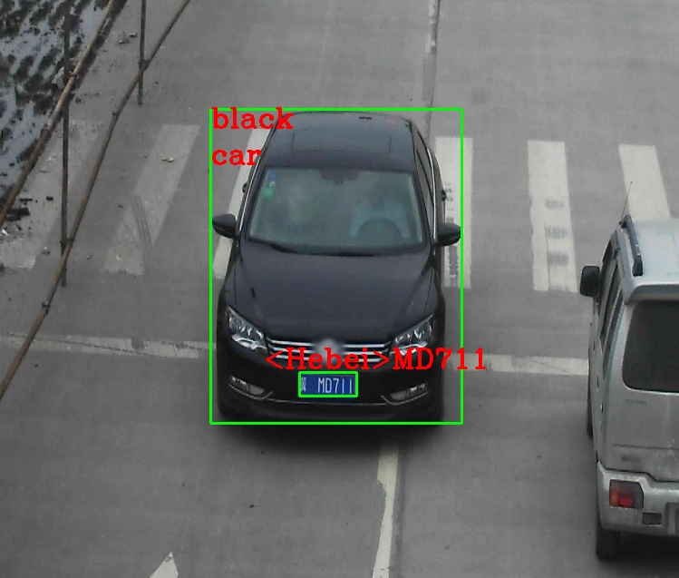

车辆车牌识别演示
================

本演示展示了车辆和车牌检测网络，以及在检测结果之上应用的车辆属性识别和车牌识别网络。您可以在演示中使用以下一组预先训练的模型：

-  ``vehicle-license-plate-detection-barrier-0106``
   是查找车辆和车牌的主要检测网络
-  ``vehicle-attributes-recognition-barrier-0039``
   会根据第一个网络的结果执行，并报告常规车辆属性，例如车辆类型（\ ``car``
   / ``van`` / ``bus`` /``track``\ ）和颜色
-  ``license-plate-recognition-barrier-0007``
   在第一个网络的结果之上执行，并报告每个识别的牌照的字符串

其他演示目标包括：

-  视频 / 摄像头作为输入（通过 OpenCV ）
-  复杂异步网络管道的示例：在车辆检测结果之上执行车辆属性和车牌识别网络
-  可视化每个检测对象的车辆属性和车牌信息

安装和依赖项
------------

依赖项

-  Python ( 3.6+ )
-  OpenCV (>=3.4.0)

要安装所有必需的 Python 模块，您可以使用：

.. code:: bash
    python3 -m pip install -U pip

    pip3 install -r requirements.txt

运行演示
--------

使用 -h 选项运行应用程序会产生以下用法消息：

.. code:: bash

    usage: main.py [-h] [-nd] [-cam] [-vid VIDEO] [-db] [-n NAME]

    optional arguments:
      -h, --help            show this help message and exit
      -nd, --no-debug       阻止调试输出
      -cam, --camera        使用 DepthAI 4K RGB 摄像头进行推理 (与 -vid 冲突)
      -vid VIDEO, --video VIDEO
                            用于推理的视频文件的路径 (与 -cam 冲突)
      -db, --databases      保存数据（仅在运行识别网络时使用）
      -n NAME, --name NAME  数据名称（和 -db 一起使用）

    使用空的选项列表运行应用程序会产生一条错误消息

运行该应用程序的有效命令行示例：

.. code:: bash

    python3 main.py -cam

或

.. code:: bash

    python3 main.py -vid <path_to_video>

要运行该演示，可以使用公共或预训练的模型。要下载预训练的模型，请使用
``OpenVINO``
`模型下载器 <https://docs.openvinotoolkit.org/latest/omz_tools_downloader_README.html>`__\ 。

    该示例需要的模型已在
    `models <https://github.com/Arducam-team/depthai-examples/tree/master/security_barrier_camera/models>`__
    文件夹中。
